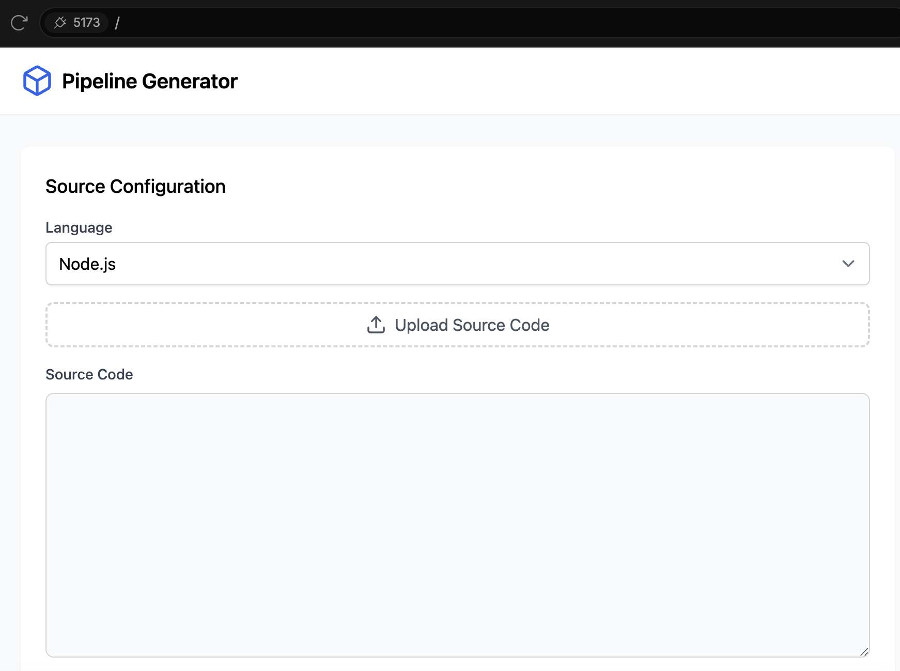
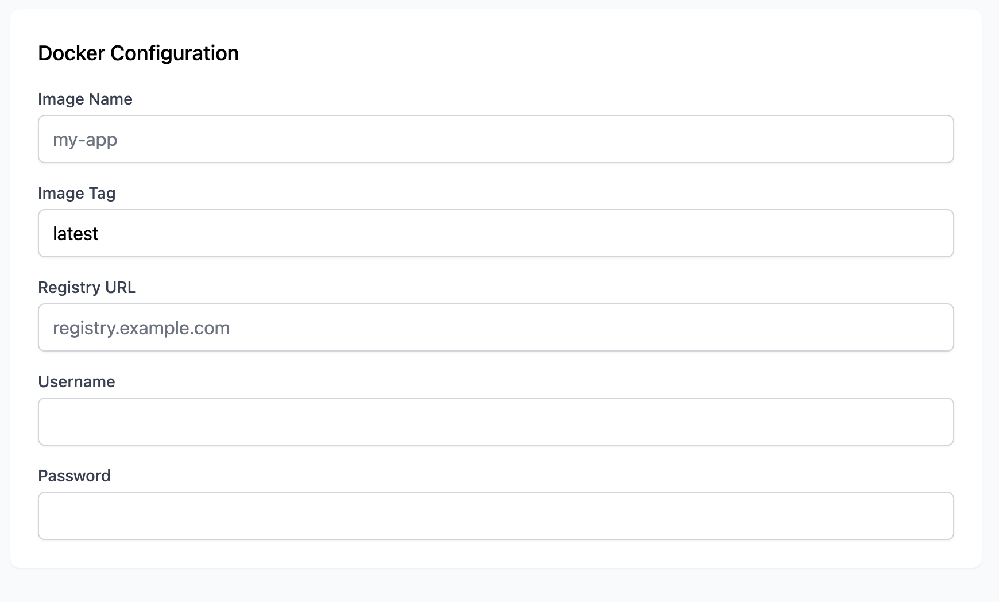
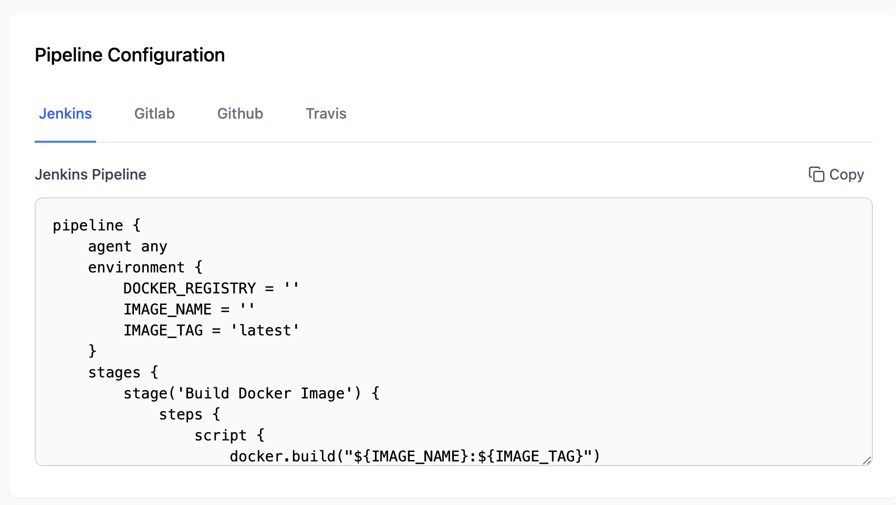
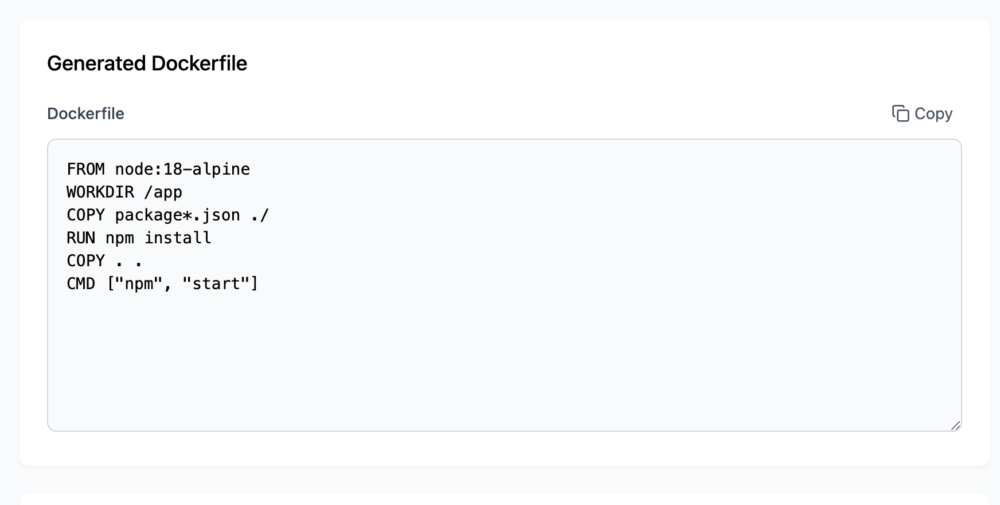

This is a pipeline generator tool for the source code given.

This tool is built with generative AI, using Bolt, from [bolt.new](https://bolt.new).   

Also I have used Cursor AI to write the README file.


Currently, it supports the following languages:

- Python
- Node.js
- Java

You can get Dockerfiles and Pipelines for these languages by running the tool.

It supports the following features:

- Dockerfile generation
- Pipeline generation for GitHub Actions, GitLab CI/CD, Jenkins, and Travis CI.


## How to use

1. Clone the repository
2. Install the dependencies
3. Run the tool

```bash
pnpm install
pnpm run dev
```

## Preview

Here are some screenshots of the tool in action:


*Homepage showing the main interface of the Pipeline Generator Tool*


*Language selection page where you can choose between Python, Node.js and Java*


*Docker configuration page to image name, docker credentials and other options*


*Pipeline configuration page to select CI/CD platforms*


*View of the generated Dockerfile and pipeline configuration files*
